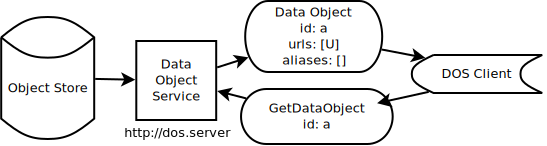
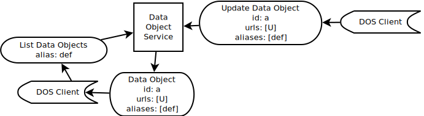
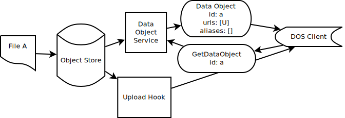
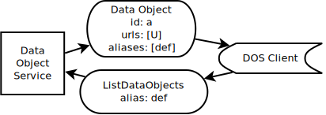

#  Identifier Interoperability

This document offers ways for platforms that are part of the NIH Data Commons
Pilot to demonstrate Key Capability 2 (KC2), which coordinates the findability of
data across Commons Platforms. This document was prepared for Team Calcium.
Examples and links from existing platforms will be added as they become
available.

If you know of useful Identifier Schemes or Services please make a Pull Request!

1. [Data Findability](#findability)
2. [Concepts](#concepts)
3. [Use Cases](#usecases)
4. [Core Metadata](#coremetadata)
5. [Identifier Schemes](#schemes)
6. [Identifier Services](#services)
7. [Case Studies](#casestudies)

## Data Findability 

This document is meant to provide strategies for Data Platforms, which have 
internal data management needs, to integrate with Identifier Services, 
Resolvers, and Prefix Services to provide a ramp to easy data interoperability. 

Data that is within a Data Platform will usually guarantee uniqueness 
within that platform. Oftentimes, the identifier scheme was chosen to satisfy
internal technical needs. However, the same identifier may represent different 
data in another platform. Globally Unique Identifiers (GUIDs) provide a 
way to address data across various platforms.

This document's Use Cases are structured in such a way to protect Data 
Platforms from changes that would alter their internal functionality: 
Data Platforms should use the identifier scheme that best suits their 
existing use case.

Satisfying Key Capability 2 (GUIDs) minimally requires Data Platforms 
to maintain aliases to GUIDs when they are available to satisfy the needs 
of findability or reproducibility. This requires, at least, a way to 
modify metadata to include newly "minted" GUIDs and later find that data
using the new identifier.

## Concepts 

### Data 

For the purposes of this document it is important to separate the concepts of
data from metadata. Data are the first order items one would like to share, 
for example, a VCF might be data, while the file checksum would be metadata.

### Metadata

Metadata describe data and are usually string keys paired with string, numeric, 
array, or object-like values. Metadata should be representable in JSON schemas.

### JSON

JavaScript Object Notation is a scheme for transmitting data between web 
services. Both metadata and interface methods for services in this document
communicate using JSON.

### Data Object

A file, resource, or API that has been uniquely identified for a given 
service, and which provides a minimum of fields from the Data Object 
Service schema.

### Data Provider

Data providers coordinate their platforms using internal tools, which they 
have they often have the ability to rapidly iterate on. Data providers may 
provision data using a variety of storage and metadata indexing services.

### Identifier Service

Registries allow identifiers for data to be managed and shared separately
from the data. They require core metadata in order to register an item.

### Prefix Service

In order to provide stable identifier namespaces, prefix services like 
[identifers.org](https://identifiers.org) allow one to redirect prefixes, 
like `dos`, to stable URLs. They only store metadata about the service.

### Identifier Resolver Service

Using a given identifier, these services allow clients to find the proper 
service to resolve more metadata about the Data Object.

### Identifier Scheme

The template that is used to issue new identifiers for a given service, 
for example, UUID has the format `4be0071d-b36e-4414-a7ee-7b879f60be7a`, 
whereas, another service may iterate numerically from 0.

## Use Cases 

### 1 Providing a GUID for a Data Object via client

#### 1.1 Get a Data Object by Data Object Identifier 

A Data Provider offers some data that can be uniquely identified using an
internal identifer scheme. Using a DOS client the Data Object can be retrieved
using a Data Object Identifier.

#### 1.2 Register the Data Object URL at an Identifier Service

The client then modifies the local metadata format 
to accord to an Identifier Service's request schema. The client then requests 
a "newly minted" identifier for the Data Object from the Identifier Service. 
And modifies the metadata of their local copy of the Data Object to 
include the GUID as an alias.

#### 1.3 Update the Data Object Metadata

The client then requests to update the Data Object by sending an Update request
to the DOS. Then, another client can find the data by GUID by listing
Data Objects that match the requested GUID.

### 2 Providing a GUID for a Data Object Automatically

#### 2.1 Using an Upload Hook to Get A Data Object

By using an Upload Hook that subscribes to changes to the Object Store, 
or which periodically polls for changes against a Data Object Service, 
software can automate the retrieval a Data Object. This is similar to how a 
client performed the retrieval in [1.1](#1.1), without requiring human 
intervention.

The remaining interaction proceeds the same as [1.2](#1.2) with the assumption
that the Identifier Service has a simple HTTP API. This allows clients 
to automate the interaction of registering metadata.

Similar to Use Case [1](#1), data becomes resolvable by GUID once its Data Object 
metadata has been changed to reflect the newly minted external 
identifier.

By satisfying this Use Case, Data Providers can provide strong guarantees 
that all their data will be resolvable across platforms.

##### A Note Regarding Automated GUID Registration

It is expected that in practice some mixture of automated and curated aliasing 
will be used. Take, for example, the case that a Data Object has had a GUID
registered for it by another Data Provider. 

Automatically generating another  GUID for this same Object would pollute 
the identifier space. It is up to Data Providers to 
enact data management policies that will reduce unnecessary usage of GUIDs.
Proper usage of the Data Object Service should allow platforms to reason 
about the presence of some data in another platform before minting another 
GUID.

### 3 Using a client to find data using a GUID

#### 3.1 Using a client to find data hosted on a single platform

A client with a GUID should be able to make a request to a Data Provider 
for data that matches that GUID. If the metadata for the item includes 
a GUID, the metadata for that item will be returned, which includes 
details necessary to access or download the Data Object.

This presumes that Use Case [1](#1) has been fulfilled, such that content 
can be addressed by GUID.

#### 3.2 Using a client to find data on multiple platforms

Assuming that [1](#1) has been fulfilled across platforms, a DOS client 
with a GUID should be able to resolve that data across platforms. The 
client makes a request to each platform's respectively, and the platform 
returns a list of matching Data Objects. These Data Objects may differ 
in their url, or other metadata, but should through proper identifier reuse 
point to the same data.

It is important to note that since GUIDs are unique as a matter of service 
they cannot be addressed uniquely across platforms. Instead a list of
Data Objects matching the alias is returned to ease the process of forming 
consensus around identity.

### 4 Resolving Data Object Identifiers across platforms

A client with a Data Object Identifier should be able find the Data 
for that identifier without requesting from each of the Commons 
Platforms. Instead of making the request against each platform, 
they make their request to an identifier resolver, which will either
return the proper metadata from the Data Provider, or redirect 
the client to it.

### 5 Resolving Data Object Identifiers across platforms using a Prefix Service

Using an identifier and a prefix, a client should be able to request 
more metadata for a given Data Object. The client first makes a request 
against a prefix service with the proper prefix and identifier, the 
request is then redirected to an Identifier Resolver Service, which 
either redirects or returns metadata necessary to access the Data 
Object.

## Core Metadata Requirements 

The minimal metadata required to register for a GUID depends on the 
underlying service and use case. However, to improve interoperability, 
these metadata should be describable using [JSON schemas](http://json-schema.org/).

For the purposes of registering a Data Object, which makes accessible 
some data via URL, it is expected that a URL at minimum is provided. A 
list of typed checksums should be provided when available to 
verify downloads. For more information see [Data Object Service Schemas](https://github.com/ga4gh/data-object-service-schemas).

Identifier services will require more or less information depending 
on the use case covered. For example, issuing a DOI for a paper would require 
a list of authors.

## Identifier Schemes 

Data Platforms are NOT required to use a normalized identifier scheme.
A number of identifier schemes exist that can be used to ensure 
uniqueness across services.

* [minid](http://eid.difi.no/en/minid) - Minimum viable identifier.
  * [White paper](http://bd2k.ini.usc.edu/assets/all-hands-meeting/minid_v0.1_Nov_2015.pdf)
* [Archival Resource Key (ark)](https://ipfs.io/ipfs/QmXoypizjW3WknFiJnKLwHCnL72vedxjQkDDP1mXWo6uco/wiki/Archival_Resource_Key.html) - Persistent URL based identifiers.
* [Universally Unique Identifier (UUID)](https://en.wikipedia.org/wiki/UUID) - 128-bit number to uniquely address data.
* [ORCID](https://orcid.org/) - Link researchers and research.

## Identifier and Prefix Services 

Public services for registering identifiers exist. They differ in 
their required metadata, provided services, and necessary metadata.
These services should be used with the appropriate above services
to register a GUID as necessary.

* [Name to Things (n2t.net)](http://n2t.net/) - Register URLs to resolve identifiers.
* [identifiers.org](http://identifiers.org/) - Register prefixes, interoperable with n2t.
* [DataCite.org](https://www.datacite.org/) - Register DOIs.

## Case Studies

### HCA Data Storage System Case Study 

To provide practical instruction into how GUID resolution can 
work in the in the Data Commons we offer this brief case study 
of interoperating with the Human Cell Atlas Data Storage System, 
which replicates data across cloud stores.

TODO

